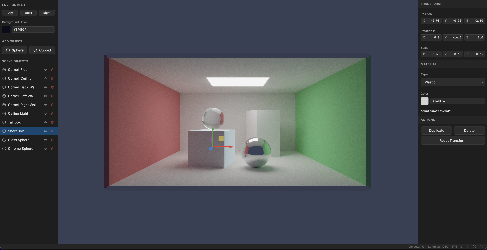

# Lightshow

Lightshow is a browser-based real-time raytracing playground built with **WebGPU**, **React**, **TypeScript**, and **Vite**.



## Requirements

- A WebGPU-capable browser (latest Chrome/Edge recommended).
- Node.js + npm.

## Development

```bash
npm install
npm run dev
```

## Build / Preview

```bash
npm run build
npm run preview
```

## Lint / Test

```bash
npm run lint
npm run test -- --run
```

## Controls (high-level)

- **Mouse**
  - Left-drag: orbit camera
  - Shift + left-drag (or middle-drag): pan
  - Wheel: zoom
- **Selection / Gizmos**
  - Click: select object
  - **W**: translate gizmo
  - **E**: rotate gizmo
  - **R**: scale gizmo
- **Editing**
  - Delete / Backspace: delete selected
  - Ctrl/Cmd + D: duplicate selected
  - Ctrl/Cmd + Z / Y: undo / redo

## Deployment (Cloudflare Pages)

- Security/caching headers live in `public/_headers`.
- The app is static; hosting serves the built files, while all rendering runs client-side.


