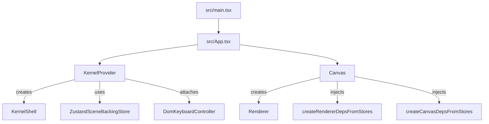

# Components, contracts, and wiring

This doc describes the **decoupled components** in the codebase, the **contracts** between them, and **where wiring happens**.

## Component inventory

- **Ports**
  - **Role**: cross-module contracts (types only).
  - **Contracts**: `Command`, `KernelQueries`, `KernelEvents`.
  - **Entry**: `src/ports/index.ts`.

- **Kernel**
  - **Role**: single authority for state transitions and history.
  - **Consumes**: a `KernelBackingStore` (internal interface) to read/write scene state.
  - **Exposes**: `dispatch(command)`, `queries.getSceneSnapshot()`, `events.subscribe(...)`.
  - **Entry**: `src/kernel/Kernel.ts`.

- **Renderer backend**
  - **Role**: WebGPU rendering loop.
  - **Consumes**: `RendererDeps` (kernel queries/events + camera/gizmo getters) via constructor injection.
  - **Entry**: `src/renderer/Renderer.ts`.

- **UI driver**
  - **Role**: React UI rendering and event handling.
  - **Consumes**: kernel via `KernelProvider` + `useKernel()`.
  - **Entry**: `src/App.tsx`, `src/components/*`.

- **Input controllers**
  - **Role**: translate DOM/input events into commands (and other adapter actions like camera orbit).
  - **Examples**:
    - `src/adapters/input/DomKeyboardController.ts`
    - `src/core/CameraController.ts` (DOM event controller with injected deps)

- **Bench harness**
  - **Role**: automated performance gate runner (TTFF + orbit FPS).
  - **Runner**: `bench/run.mjs`
  - **In-app bridge**: `src/bench/benchBridge.ts` (only enabled via `?__bench=1`)

- **Zustand store adapters**
  - **Role**: concrete adapters backed by Zustand stores.
  - **Examples**:
    - `src/adapters/zustand/ZustandSceneBackingStore.ts`
    - `src/adapters/zustand/createRendererDepsFromStores.ts`
    - `src/adapters/zustand/createCanvasDepsFromStores.ts`

## Contracts and data flow

### Runtime data flow

```mermaid
flowchart LR;
UI["UI (React components)"] -->|dispatch(Command)| K[Kernel]
UI -->|queries.getSceneSnapshot()| K
K -->|events.subscribe(...)| UI

UI -->|injects deps| R[Renderer]
R -->|queries.getSceneSnapshot()| K
K -->|events| R

K -->|get/set scene state| BS["BackingStore implementation"]
BS --> S["Zustand stores"]
```

### Composition root (wiring)



## Replacement guides (how to swap components)

### Replace the Kernel with a mock (tests)

Use `KernelProvider`’s optional `kernel` prop to inject a stub:

```ts
<KernelProvider kernel={mockKernel}>
  <AppInner />
</KernelProvider>
```

### Replace the renderer backend

Renderer is created in `src/components/Canvas.tsx`. For headless tests, you can:
- render components without mounting `Canvas`, or
- pass a custom `onRendererReady` and avoid using the renderer instance.

### Replace input controllers

- Keyboard: `src/adapters/react/KernelContext.tsx` attaches `DomKeyboardController`.
- Camera: `Canvas` creates `CameraController` with injected deps.

To replace, attach a different controller in the same wiring locations.


